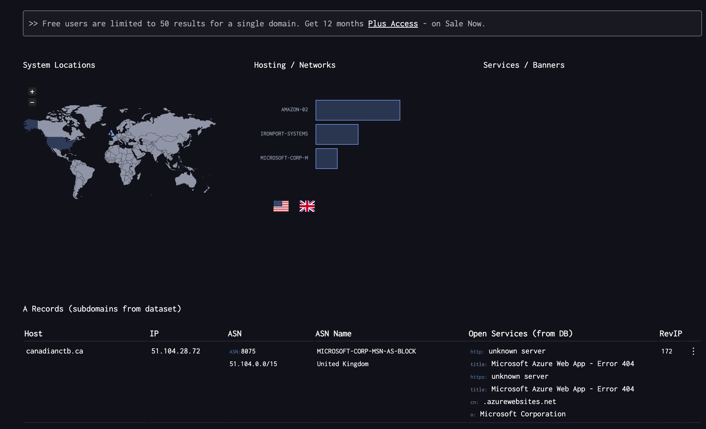
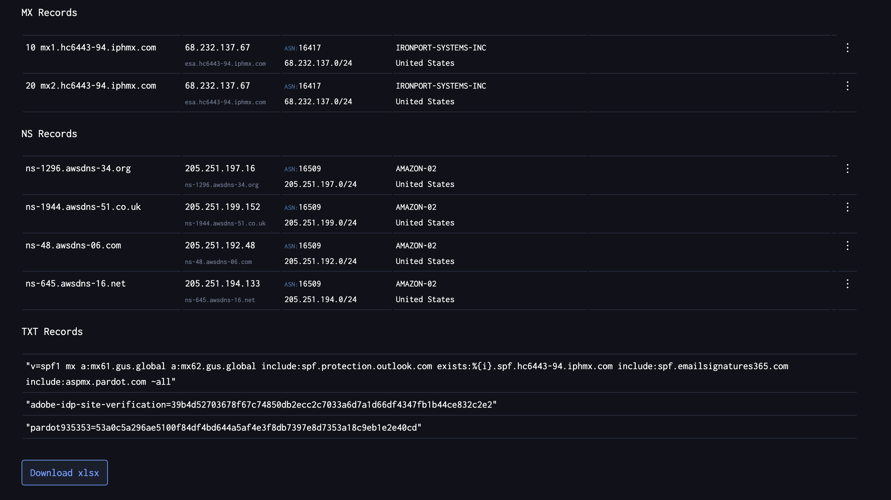

# Web Services

## pentestmonkey
[pentestmonkey](https://pentestmonkey.net/) is a website that provides a list of 
variety of tools, cheat‑sheets (for SQL injection, reverse shells, etc.) for security testing.

## GTFOBins

[GTFOBins](https://gtfobins.github.io) is a website that provides a curated list of Unix binaries that can be used to bypass local security restrictions in misconfigured systems.

### Example: env
[/bin/env](https://gtfobins.github.io/gtfobins/env/) does not drop the elevated privileges and may be used to access the file system, escalate or maintain privileged access.

```shell
$ sudo env /bin/bash
id
uid=0(root) gid=0(root) groups=0(root)
```

## DNSDumpster
[DNSDumpster.com](https://dnsdumpster.com/) is a free online service that allows you to find details about a domain name's DNS records.





## Shodan
[Shodan](https://www.shodan.io/) is a search engine that allows you to search for devices on the internet.

For example, You can search any website using Next.js with a specific version.